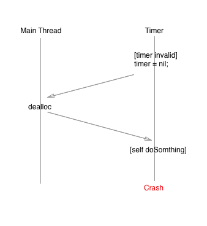
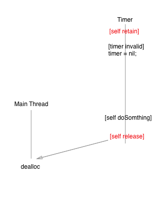
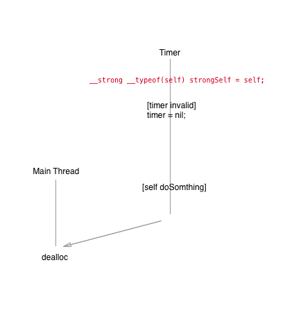
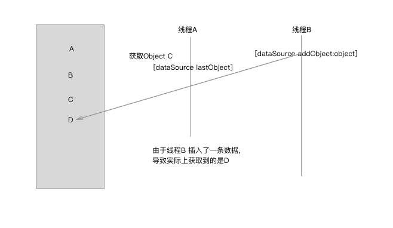
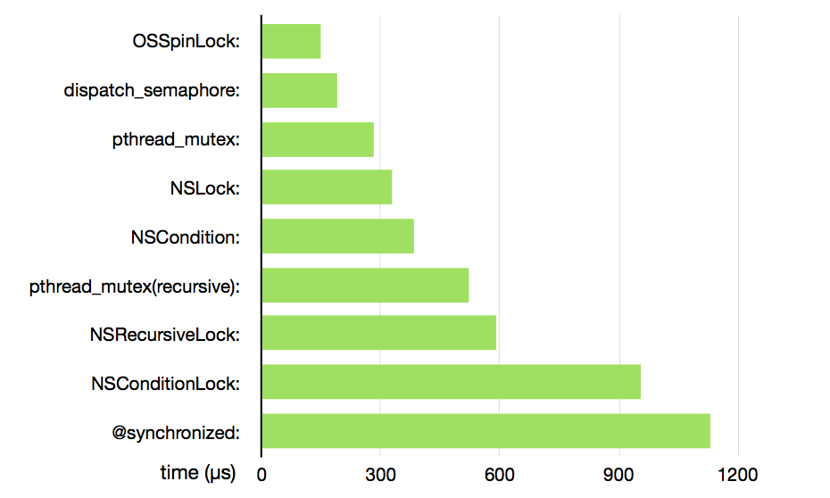
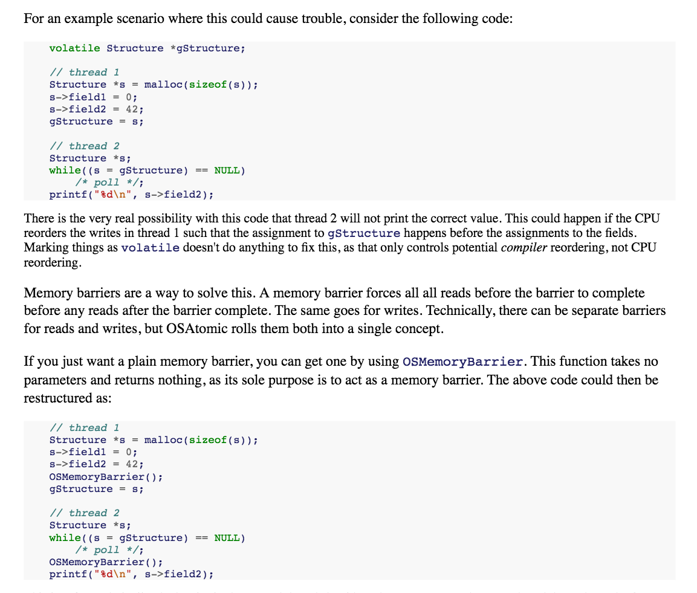
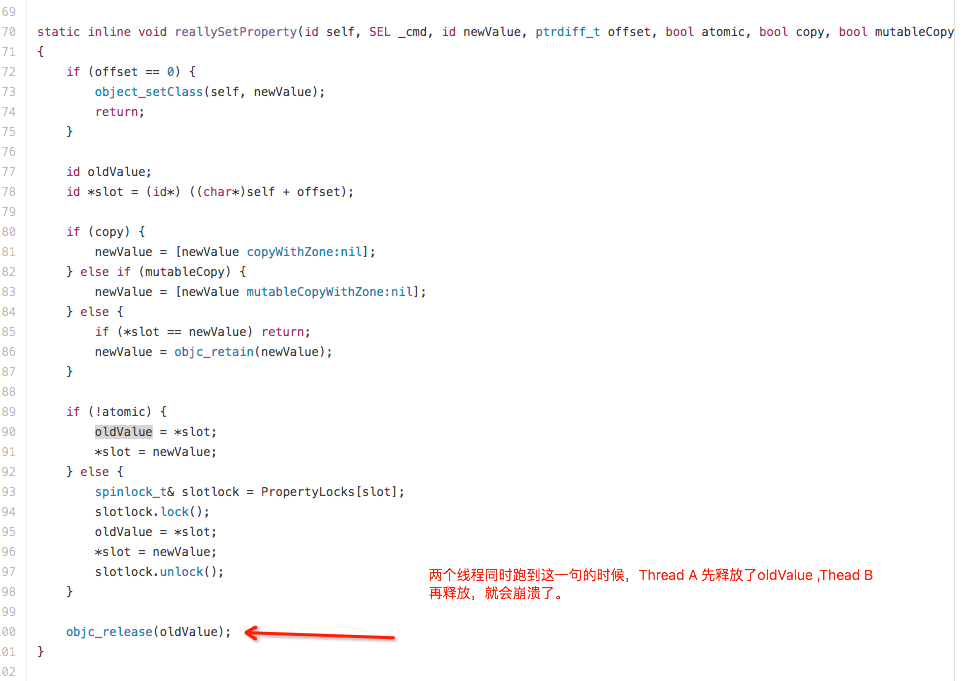

#线程安全

前段时间写代码的时候，没有注意到线程同步的问题，结果在发布前，加班找问题了。
现在想想也算是一个低级错误了。Mark 下来，以后多注意。顺便在端午假期复习一下多线程的知识。


当同事把崩溃报告发给你的时候，对于自己写的类，含着泪也要把它修复。

##场景一
```
//在MRC环境下，使用Block 来设置下载成功的图片。当self释放后，
//weakSelf变成野指针,接着就悲剧了

 __block ViewController *weakSelf = self;
 [self.imageView imageWithUrl:@"" completedBlock:^(UIImage *image, NSError *error) {
        
        NSLog(@"%@",weakSelf.imageView.description);
 }];
    
```


修改方法很简单，在回调回来之前，不让self 释放。

```
[self.imageView imageWithUrl:@"" completedBlock:^(UIImage *image, NSError *error) {
        
      NSLog(@"%@",self.imageView.description);
             
}];
```

在现在ARC 的时代，这种问题已经不是问题了。

##场景二

```
- (void)setImageView:(UIImageView *)imageView
{
    if (![_imageView isEqual:imageView])
    {
        [_imageView release];
        _imageView = [imageView retain];
    }
}

```

咋一看没什么问题，是的，在单线程下是没问题的。但是如果在多线程下面就会有大问题了。
***[_imageView release];*** 这段代码可能会被执行两次，那么Crash again。
其实从这里可以联想到，因为UIKit 不是线程，所以在不是主线程的地方调用UIKit 的东西，有可能在开发阶段完全没问题，直接免测。但是一到线上，崩溃系统可能都是你的崩溃日志。Holy shit!

聪明的github 们，早就有解决办法：[通过hook 住setNeedsLayout，setNeedsDisplay，setNeedsDisplayInRect来检查当前调用的线程是否是主线程](https://gist.github.com/steipete/5664345)。

下面会有更详情的分析，请继续看。
##场景三

使用NSTimer,坑还是不少的。首先timer 会retain ，当timer 被invalid 之后，self 就会dealloc。如果此时，在timer 的线程，还执行self 对象的方法，Crash again.

具体的流程是这样的。



修改的方法很简单，在MRC 下，可以这么修改。虽然代码看起来很恶心



在ARC 下就优雅得多



##场景四

数据源DataSource 是一个NSMutableArray，线程A 读取lastObject ,线程B 添加一个object 到数组里面。由于NSMutableArray 不是线程安全的，这样线程A 读取到的数据将是错的。



设计一个线程安全的类，真累。怎样才是线程安全的类？
> * 该类的对象可以被多个线程安全的访问
> * 线程访问对象的方法都可以得到正确的结果。

##在多线程下的问题，大多是锁没用好的问题。来看一下各种锁的性能数据


> * 可以看出OSSpinLock自旋锁的性能最高，实现原理简单，在资源被长时间占用时需要消耗大量的CPU，不利于较长时间的任务，对于内存缓存来说挺合适的，但是OSSPinLock在iOS 9 后不再保证安全了，这种自旋锁容易引起潜在的优先级反转
> * dispatch_semaphore_t锁的优势是在等待资源时不消耗CPU资源，适用于磁盘缓存.dispatch_semaphore 是信号量，但当信号总量设为 1 时也可以当作锁来。在没有等待情况出现时，它的性能比 pthread_mutex 还要高，但一旦有等待情况出现时，性能就会下降许多。相对于 OSSpinLock 来说，它的优势在于等待时不会消耗 CPU 资源。
> * pthread_mutex_t锁在等待时间不长的情况下拥有不错的性能，因而适用于内存缓存
> * @synchronized块会隐式的添加一个异常处理例程来保护代码，该处理例程会在异常抛出的时候自动的释放互斥锁。所以如果不想让隐式的异常处理例程带来额外的开销，你可以考虑使用锁对象。
> 
 

[各种锁的讲解1](http://www.jianshu.com/p/35dd92bcfe8c)

[各种锁的讲解2](http://www.devtalking.com/articles/read-threading-programming-guide-4/)

看了[一位国外大神写的文章，关于原子操作](https://www.mikeash.com/pyblog/friday-qa-2011-03-04-a-tour-of-osatomic.html)，才知道有OSMemoryBarrier ，它是一种屏障和指令类，可以让CPU或编译器强制将barrier之前和之后的内存操作分开。CPU采用了一些可能导致乱序执行的性能优化。在单个线程的执行中，内存操作的顺序一般是悄无声息的，但是在并发编程和设备驱动程序中就可能出现一些不可预知的行为，除非我们小心地去控制。排序约束的特性是依赖于硬件的，并由架构的内存顺序模型来定义。一些架构定义了多种barrier来执行不同的顺序约束。下面的截图来源于作者的blog




但是使用锁，就会有性能上的消耗。例如下面一段代码

```
if (self.image)
 {
     [images addObject:self.image];
 }

```
在单线程的情况下是没问题的。但是在多线程下，就会有可能。Theaad A 执行完```if (self.image)```,CPU将执行权切换到Thread B ，此时执行```self.image = nil ```.那么Thread A 开始执行``` [images addObject:self.image]``` 就会崩溃。

***多线程同步的问题 －>  加锁！***
是的，加锁可以解决这个问题。但是如果这个函数执行的频率很高，那么，就会有严重的效率问题。至少，你会被屌。因为有更加优雅的方法：

```
__strong UIImage *strongImage = self.image;
if (self.image)
{
    [images addObject:self.image];
}
```

##容易忽略的细节

先看一段代码,属性写的最多的就是nonatomic ，在多线程下就有可能崩溃。

```
@interface ViewController ()
@property (strong,nonatomic) NSMutableArray *array;
@end

```

跑一下下面这段代码,你会看到:
***malloc: error for object 0x7913d6d0: pointer being freed was not allocated***

```
for (int i = 0; i < 100; i++) {
        dispatch_async(dispatch_get_global_queue(DISPATCH_QUEUE_PRIORITY_DEFAULT, 0), ^{
            self.array = [[NSMutableArray alloc] init];
        });
    }    
```

原因就是：对象被重复relaese 了。查看一下[runtime 源码](https://github.com/opensource-apple/objc4/blob/master/runtime/objc-accessors.mm)



解决办法：

```
@interface ViewController ()
@property (strong,atomic) NSMutableArray *array;
@end

```

